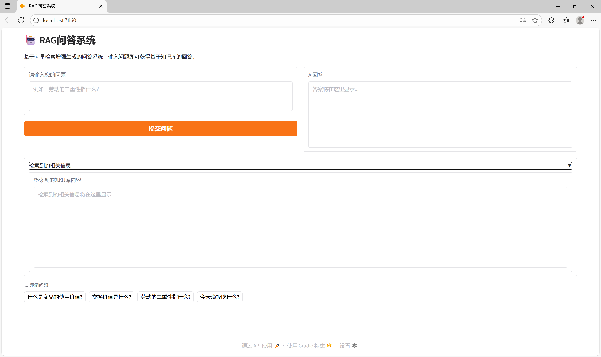
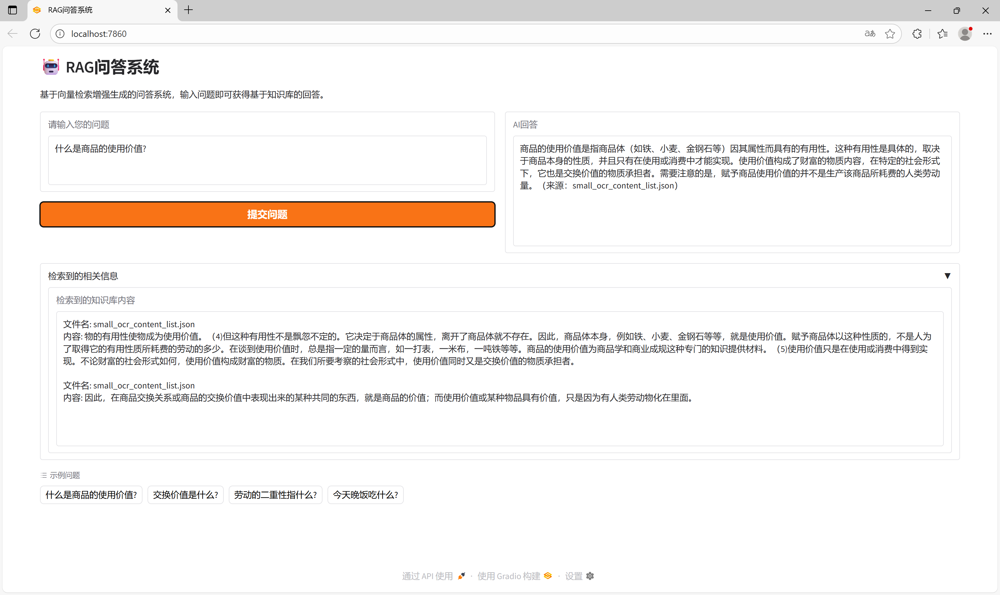
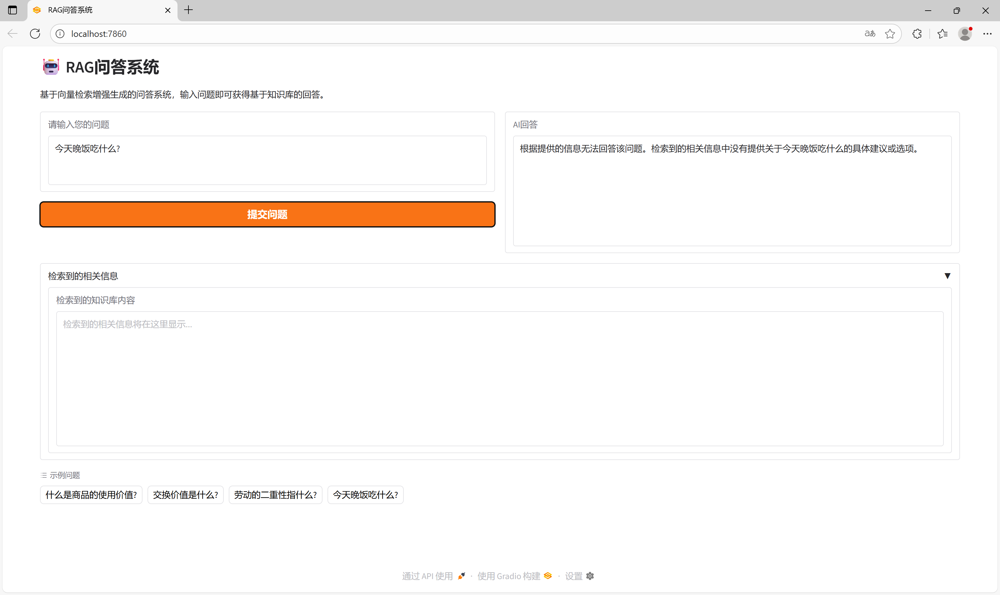

# RAG 问答系统

本项目是一个基于 **检索增强生成（Retrieval-Augmented Generation, RAG）** 架构的问答系统，使用本地向量数据库 **Qdrant** 存储知识片段，并通过大语言模型（Qwen-Max）生成答案。适用于对特定文档集进行语义问答。

## ✨ 功能特点

- 支持从 JSON 格式的 OCR 文本中构建知识库。
- 使用 `Conan-embedding-v1` 嵌入模型将文本向量化并存入 Qdrant。
- 用户提问时自动检索最相关的上下文片段。
- 基于检索结果，由 Qwen-Max 模型生成准确、简洁、有来源依据的回答。
- 提供 Gradio Web 界面，支持交互式问答与检索内容查看。

## 🔑 配置 API 密钥

在阿里云百炼平台获取 Qwen API Key。  
创建 `.env` 文件：

```env
QWEN_API_KEY=your_qwen_api_key_here
```

## ▶️ 快速启动

### 1. 初始化知识库（首次运行）

运行以下脚本将 `small_ocr_content_list.json` 中的内容导入向量数据库：

```python
from qdrant import QdrantDB

db = QdrantDB()
db.save_from_json_file("./data/small_ocr_content_list.json")
print("✅ 知识库初始化完成！")
```

### 2. 启动 Web 界面

```bash
python main.py
```

访问 `http://localhost:7860` 即可使用问答系统。

### 3. 命令行测试（可选）

```python
from rag_agent import single_agent

print(single_agent("劳动的二重性指什么?"))
```

## 📦 技术栈

- **LLM**: Qwen-Max
- **Embedding**: TencentBAC/Conan-embedding-v1  
- **向量数据库**: Qdrant
- **框架**: CAMEL  
- **前端**: Gradio  

## 📝 注意事项

- 首次运行会下载嵌入模型，请确保模型放在 `./models` 目录下。
- 所有回答严格基于检索到的上下文，不会编造信息。
- 本项目为个人学习，多有不足，欢迎指正。

## 效果演示

1. 初始状态  
   

2. 检索成功  
   

3. 检索失败  
   

Made with ❤️ using CAMEL + Qwen + Qdrant + Gradio